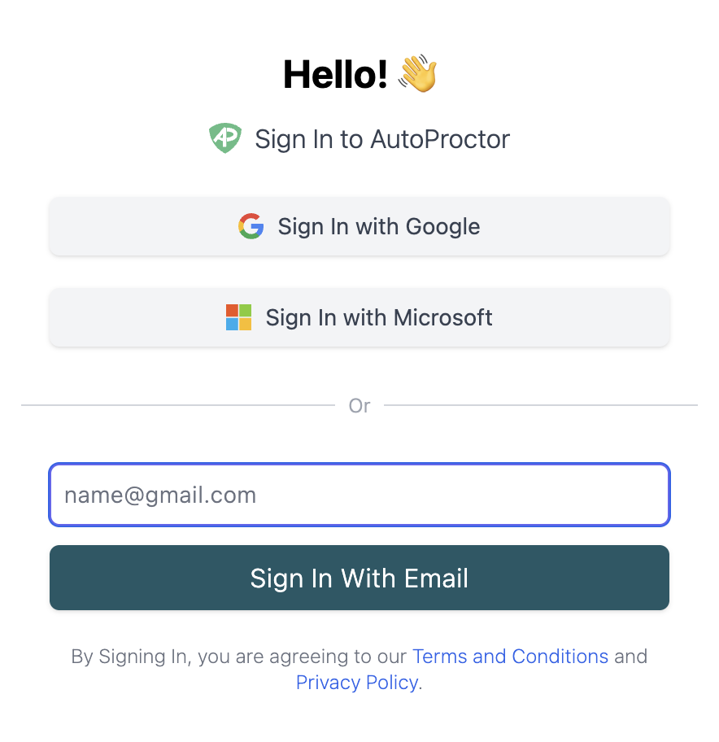

Candidates must log in before attempting any test on AutoProctor. Login is required so that AutoProctor can distinguish between individual submissions when multiple candidates use the same test link.

<iframe
  className="w-full aspect-video rounded-xl"
  src="https://www.youtube.com/embed/T9iZvk35sOc?si=ZKozRVlwbxXIiHqQ&rel=0"
  title="AutoProctor candidate login walkthrough"
  frameBorder="0"
  allow="accelerometer; autoplay; clipboard-write; encrypted-media; gyroscope; picture-in-picture; web-share"
  referrerPolicy="strict-origin-when-cross-origin"
  allowFullScreen
></iframe>

*AutoProctor login screen*

## Available Login Methods

AutoProctor offers three sign-in options for candidates:

- **Sign in with Google** -- uses the candidate's Google account
- **Sign in with Microsoft** -- uses the candidate's Microsoft account
- **Sign in with Email** -- the candidate enters their email address directly (no third-party account required)

## Login Methods by Quiz Provider

The available sign-in methods depend on which quiz provider you use:

| Quiz Provider | Available Sign-in Methods |
|---|---|
| Socratease Quizzes | Google, Microsoft, Email |
| Google Forms | Google only |
| Microsoft Forms | Microsoft only |
| IFrame Tests | Google, Microsoft, Email |


Google Forms tests require Google sign-in because AutoProctor needs to pass the candidate's Google identity to the form. The same applies to Microsoft Forms with Microsoft sign-in. Socratease and IFrame tests have no such restriction, so all three login methods are available.



To restrict which candidates can log in to your test, see [Restricting by Email](tests-results/access-limits/restricting-by-email.md). You can limit access to specific email addresses or email domains.


## Related Resources

- [How to Logout](candidate-guide/attempting/how-to-logout.md) -- Switch between accounts
- [Restricting by Email](tests-results/access-limits/restricting-by-email.md) -- Limit who can access your test
- [Restricting to Some Users](tests-results/access-limits/restricting-to-some-users.md) -- Control test access for specific users
- [Inviting Candidates via Email](tests-results/access-limits/inviting-candidates-via-email.md) -- Send test invitations directly
- [Instructions Page for Candidates](tests-results/create/instructions-page-for-candidates.md) -- What candidates see before starting a test
- [Contact Us](pricing-account/support/contact-us.md) -- Reach out if you need further help
