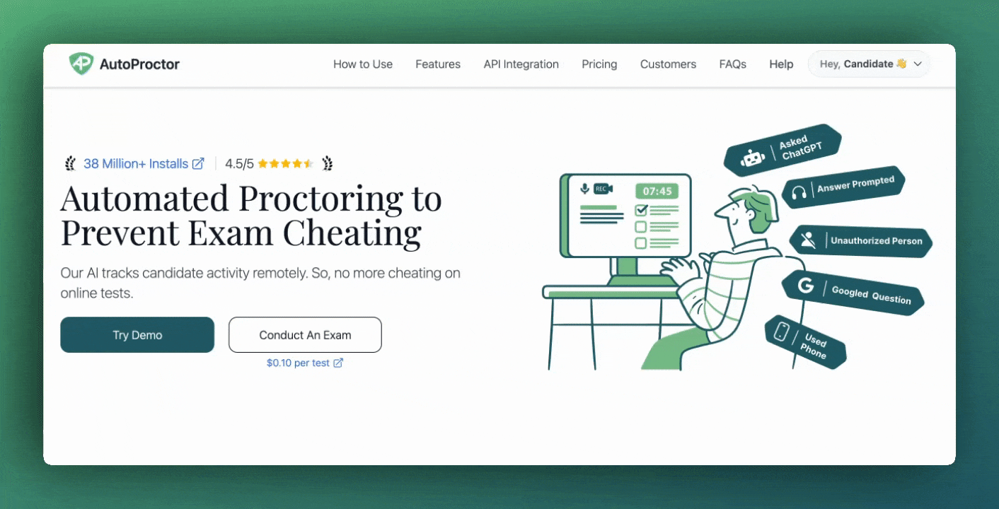

# How to Logout of AutoProctor

You may need to log out of AutoProctor if you want to switch to a different account or if you accidentally logged in with the wrong credentials.

### How to Logout

 _How to logout of AutoProctor_



#### Click on your name

Click on your **name** at the top right of the screen (where it says "Hey, ...").



#### Click Logout

Click **Logout** from the dropdown menu.



### Alternative Method

If the standard logout does not work, you can force a logout by signing out of all your Google accounts.



#### Visit Google's logout page

Go to [accounts.google.com/Logout](https://accounts.google.com/Logout) to sign out of all your Google accounts.



#### Log back in to AutoProctor

Navigate back to your test link and sign in with the correct account.



### Related Resources

* [Candidate Login Methods](candidate-guide/attempting/candidate-login-methods.md) -- Available sign-in options
* [Incorrect Candidate Name](tests-results/issues/incorrect-student-name.md) -- Fix name display issues
* [Blank Page or Grey Screen](tests-results/issues/blank-page-grey-screen.md) -- Often caused by wrong Google account
* [Instructions for Taking a Proctored Test](candidate-guide/attempting/proctored-test-instructions.md) -- Full setup guide for proctored tests
* [Contact Us](pricing-account/support/contact-us.md) -- Reach out if you need further help
