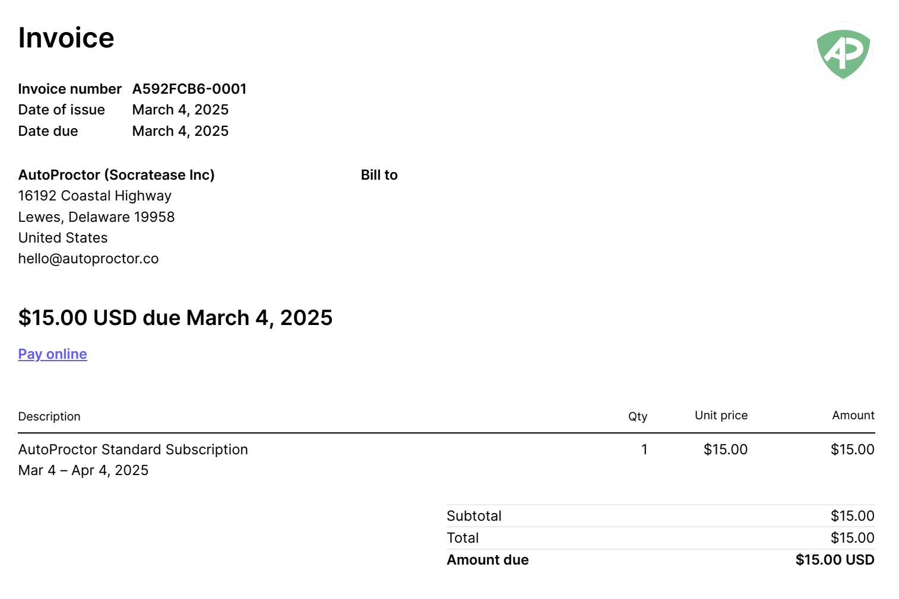

AutoProctor automatically generates an invoice and receipt for every successful payment. This article explains how to access your invoices and answers common questions about billing documents.

## When Are Invoices Generated?

Invoices are generated for two types of payments:

| Payment Type | When It Happens |
|---|---|
| **Subscription creation and renewal** | When you first subscribe or when your plan auto-renews |
| **Credit top-ups** | When you purchase additional credits through Test Packs |

For each payment, an invoice and receipt are automatically emailed to the account holder.


If you are part of a [Team](pricing-account/billing-teams/teams.md), the person who made the initial purchase receives the invoice emails. All Team Admins can also download invoices from the Billing section.


## Downloading Invoices

If you cannot find the invoice email or need to download a copy:



### Open the Billing section
Click on the **Billing** link in your left sidebar.


### Locate the invoice
Scroll to the payment history area. Each payment entry includes a download link for the corresponding invoice.


### Download the invoice
Click the download link to save the invoice as a PDF to your device.



You can learn more about the Billing section in the [Editing Billing Information](pricing-account/billing-teams/billing-information.md) article.

## Sample Invoice

Below is an example of what an AutoProctor invoice looks like:

## Frequently Asked Questions

<AccordionGroup>
  <Accordion title="I did not receive an invoice email. What should I do?">
    Check your spam or junk folder. If you are part of a Team, the invoice may have been sent to the Team Admin who made the original purchase. You can also download the invoice directly from the **Billing** section.
  </Accordion>

  <Accordion title="Can I change the billing details on an invoice?">
    You can update your billing information (company name, address, GST, etc.) from the **Billing** section, but changes only apply to **future invoices**. For amendments to an already-issued invoice, email **hello@autoproctor.co** with the details.
  </Accordion>

  <Accordion title="Are invoices available for expired subscriptions?">
    Yes. Invoice records are retained even after your subscription expires. You can access them by resubscribing or by contacting support at **hello@autoproctor.co**.
  </Accordion>

  <Accordion title="Can I get a consolidated invoice for multiple payments?">
    AutoProctor generates individual invoices per payment. If you need a consolidated statement, contact support at **hello@autoproctor.co** with your requirements.
  </Accordion>
</AccordionGroup>

## Related Resources

- [Editing Billing Information](pricing-account/billing-teams/billing-information.md) -- Update your company name, address, and payment method
- [Payments and Credits Explained](pricing-account/plans-credits/payments-and-credits.md) -- Understand subscriptions and credit purchases
- [What is a Team?](pricing-account/billing-teams/teams.md) -- Learn about team billing and admin access
- [How to Cancel Your Subscription](pricing-account/plans-credits/cancel-subscription.md) -- Download invoices before cancellation
- [Contact Us](pricing-account/support/contact-us.md) -- Get help with invoice issues
