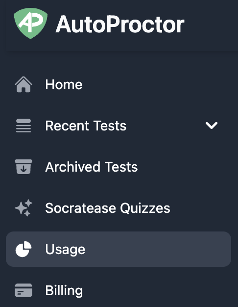
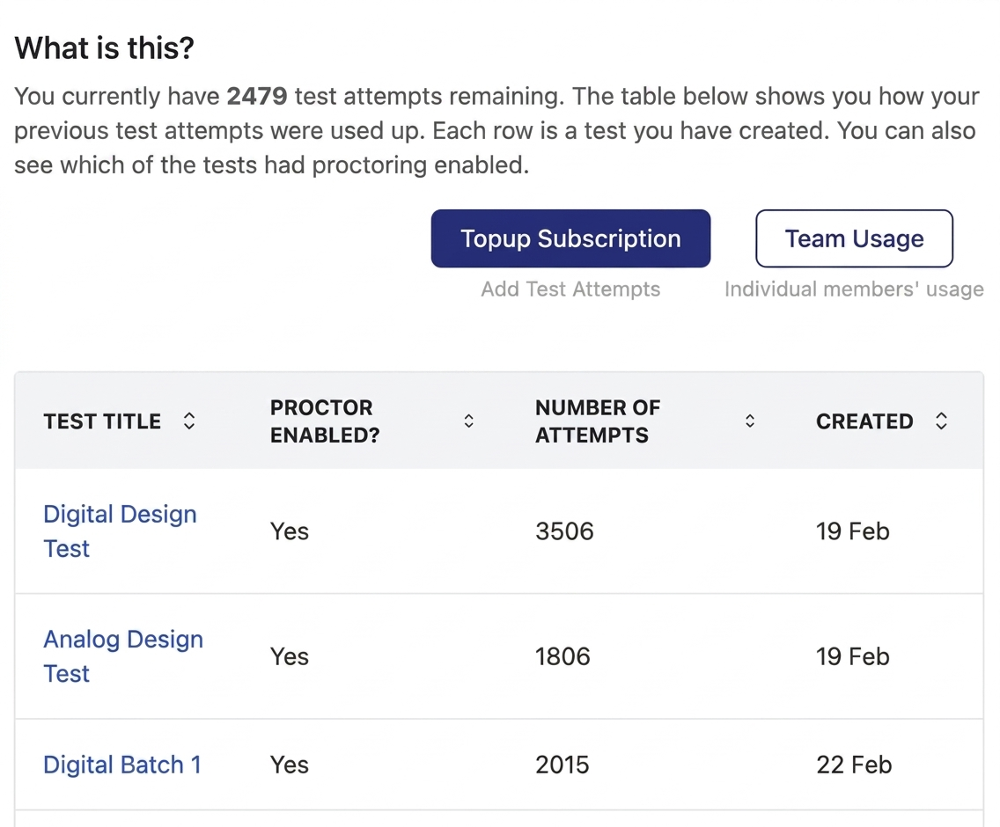
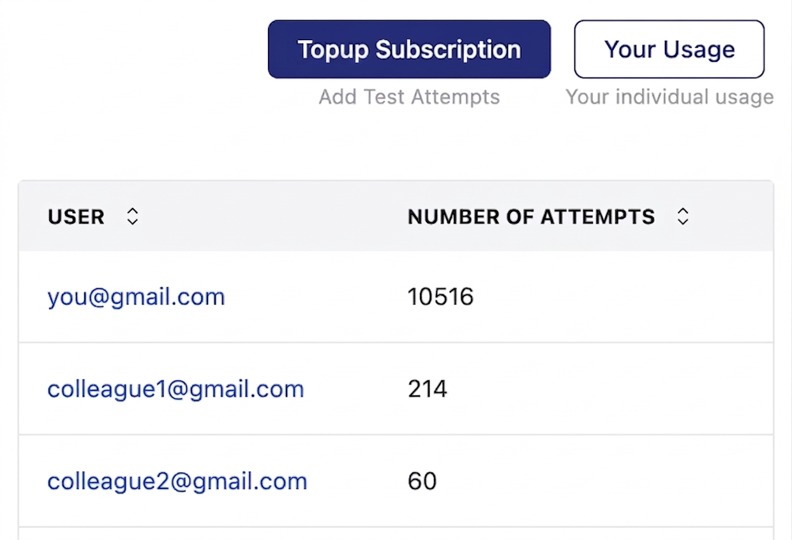

# Track Your Test Pack Credit Usage

AutoProctor provides a dedicated Usage dashboard that shows exactly how your credits are being consumed. You can track usage per test and, if you are part of a team, per team member.

### How Credits Work

Credits are added to your account when you create a subscription, when it renews, or when you purchase Test Pack top-ups. Each time a candidate starts a test, one credit is deducted. The Usage page gives you a clear view of where those credits go.

### Viewing Your Credit Usage



#### Open the Usage page

Click on the **Usage** tab in your left sidebar.

 _Usage link in the sidebar_



#### Review the usage table

You see a table showing the number of credits used per test. Click on any test title to open the results for all attempts of that test.

 _Usage table_




If a test has been shared with multiple test administrators, only the **primary admin (the test creator)** sees it listed on their Usage page.


### Team Usage

If you are part of a [Team](pricing-account/billing-teams/teams.md), the Usage page shows your personal test data by default. To view credit consumption across the entire team:



#### Click Team Usage

Click the **Team Usage** button at the top right of the Usage page.



#### Review team-wide consumption

The team usage view displays a table with **all team members and the total number of credits each member has used**. Click on any member to drill down into their individual test-level usage.

 _Team usage table_




Only Team Admins and the individual member themselves can view detailed per-test usage. Regular team members can see the summary view but not other members' individual breakdowns.


### Related Resources

* [Payments and Credits Explained](pricing-account/plans-credits/payments-and-credits.md) -- How credits, subscriptions, and top-ups work
* [What is a Team?](pricing-account/billing-teams/teams.md) -- Understand team billing and shared credits
* [Purchased Packs Not Showing Up](pricing-account/billing-teams/purchased-packs-not-visible.md) -- Troubleshoot missing credits
* [Concurrency](tests-results/access-limits/concurrency.md) -- Understand concurrent test attempt limits
* [Contact Us](pricing-account/support/contact-us.md) -- Get help with usage discrepancies
