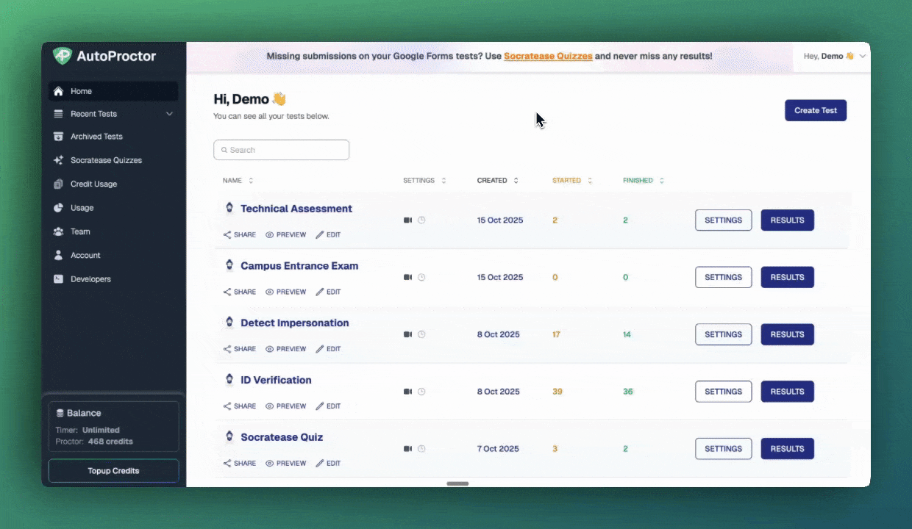

# Payments and Credits Explained

AutoProctor uses a credit-based billing system. Every test attempt by a candidate consumes one credit, and you purchase credits through subscriptions and optional top-ups. This page explains the full billing model so you can plan your credit needs.

### Free Credits

When you create a Test Admin account on AutoProctor, you get **10 free credits**. Each credit corresponds to a single test attempt.

For example, with 10 credits you can have 10 candidates attempt 1 test each, or 5 candidates attempt 2 tests each. Once you use up the free credits, you must purchase a subscription to continue.

### Purchase a Subscription

AutoProctor offers **3 plans** and **3 billing frequencies**:

| Plan         | Features                                                                   |
| ------------ | -------------------------------------------------------------------------- |
| **Standard** | Core proctoring and timer features                                         |
| **Premium**  | Standard features + Google Sheets integration, teams, and more             |
| **Elite**    | Premium features + API access, question banks, and advanced question types |

| Billing Frequency | Renewal Cycle                       |
| ----------------- | ----------------------------------- |
| **Monthly**       | Renews every month on the same date |
| **Quarterly**     | Renews every 3 months               |
| **Yearly**        | Renews every 12 months              |

**Example:** If you purchase the Monthly Standard plan on March 5th, you pay X dollars. You are then charged X dollars on the 5th of each subsequent month. If you choose a different frequency (Quarterly, Yearly), the renewal date adjusts accordingly.


Subscriptions auto-renew. To stop the auto-deduction, you must [cancel your subscription](pricing-account/plans-credits/cancel-subscription.md) before the renewal date.


When you purchase a subscription, you receive a set number of credits (for example, 150). Every time the subscription renews, the same number of credits are added to your account.

### Top Up Your Subscription

 _How to add credits_

If you need more credits than your plan provides in a given billing cycle, you can purchase **Test Packs**. Each Test Pack contains a fixed number of credits, and you can buy as many as you need.

Top-ups are a **one-time cost**. The credits remain available as long as your subscription is active.


If you purchased Test Packs but cannot see them in your account, see [Purchased Packs Not Showing Up](pricing-account/billing-teams/purchased-packs-not-visible.md) for troubleshooting steps.


### Credit Rollover


As long as you maintain an active subscription (meaning you pay each month, quarter, or year), **credits do not expire -- they roll over** into subsequent billing periods.


If you purchased 600 extra credits in one month but only used half of them, the remaining credits carry forward. In the next billing period, you have those unused credits plus your renewal credits, all available for immediate use.

### Discounts

AutoProctor offers discounts on longer billing frequencies (Quarterly and Yearly vs. Monthly) as well as bulk top-up purchases:

| Top-Up Credits | Discount |
| -------------- | -------- |
| 1,500 – 2,999  | 5% off   |
| 3,000+         | 10% off  |

Visit the [Pricing Page](https://www.autoproctor.co/pricing/) for details and use the Pricing Calculator to estimate your costs.

### Related Resources

* [Track Test Pack Usage](pricing-account/billing-teams/track-test-pack-usage.md) -- Monitor how your credits are being consumed
* [How to Cancel Your Subscription](pricing-account/plans-credits/cancel-subscription.md) -- Step-by-step cancellation instructions
* [One-Time Subscription](pricing-account/plans-credits/one-time-subscription.md) -- Use AutoProctor for a single event
* [Elite Features](pricing-account/plans-credits/elite-features.md) -- Features available on the Elite plan
* [Invoices for Payments](pricing-account/billing-teams/invoices.md) -- Access and download your invoices
* [FAQs](understanding/getting-started/faqs.md) -- Common questions about AutoProctor
