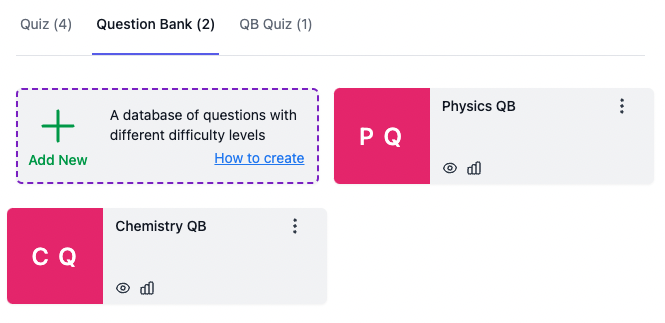

Question Banks let you create large pools of questions and serve a random subset to each candidate. Every candidate receives a different combination of questions, reducing the chance of cheating while maintaining a consistent assessment structure.


Question Banks are an **Elite** plan feature. You need an Elite subscription to create and use Question Banks and Question Bank Quizzes. See [Elite Features](pricing-account/plans-credits/elite-features.md) for details.


## What is a Question Bank?

A Question Bank (QB) is a collection of questions organized by subject or topic. Each question in the bank can have a different point value and difficulty level. When candidates take a test, they receive a randomly selected subset from the bank rather than the full set of questions.

### Example: Physics and Chemistry Tests

Imagine you have two Question Banks:
- **Physics Question Bank** -- 100 questions across various difficulty levels
- **Chemistry Question Bank** -- 100 questions across various difficulty levels

You can create different quizzes that draw from these banks with different weightings:

| Quiz | Physics Questions | Chemistry Questions | Total |
|---|---|---|---|
| Physics Major Quiz | 40 questions (2 points each) | 10 questions (1 point each) | 50 questions |
| Chemistry Major Quiz | 10 questions (1 point each) | 40 questions (2 points each) | 50 questions |

Each candidate receives a different random subset of questions from the respective banks, but the overall structure (number of questions, points, difficulty distribution) stays consistent across all candidates.

## Question Bank Quizzes (QBQ)


Candidates cannot attempt a Question Bank directly. You must create a Question Bank Quiz and add it to an AutoProctor test for candidates to take.


*Question Bank Quiz overview showing created QBQs*

A Question Bank Quiz specifies:
- Which Question Banks to draw questions from
- How many questions to include from each bank
- The difficulty levels to include
- The point values for each difficulty level

You can combine multiple Question Banks in a single QBQ, or use one bank to supply questions at varying difficulty levels.

## How to Create a Question Bank Quiz


How to create a Question Bank Quiz




### Create a Question Bank
Navigate to the Question Banks section in AutoProctor and create a new Question Bank. Add your questions, assigning point values and difficulty levels to each.



### Create a Question Bank Quiz
Create a new Question Bank Quiz (QBQ). Select which Question Banks to draw from, how many questions to include, and which difficulty levels to use.



### Add to an AutoProctor Test
Add the QBQ to an AutoProctor test. Share the test link with your candidates.




## Related Resources

- [Bulk Import from Excel](socratease/create-questions/bulk-import-from-excel.md) -- Import questions in bulk to populate your Question Banks
- [Question Types](socratease/create-questions/question-types.md) -- Available question formats for use in Question Banks
- [Using Tags](socratease/settings/using-tags.md) -- Organize questions with tags for filtering and grouping
- [Quiz Settings](socratease/settings/quiz-settings.md) -- Configure your quiz behavior
- [Elite Features](pricing-account/plans-credits/elite-features.md) -- Learn about Elite plan capabilities
