# Socratease Question Types

Socratease offers 13 distinct question formats to assess candidates across different skill areas. These range from traditional multiple-choice to advanced formats like voice recording, drag-and-drop matching, and auto-graded text responses.


Not all question types are available on every plan. See [Question Type Availability](socratease/create-questions/question-type-availability.md) for details on which types are included in your plan.


### Available on All Plans

#### 1. MCQ (Multiple Choice Question)

A question with only one correct answer. Candidates select a single option from the available choices.

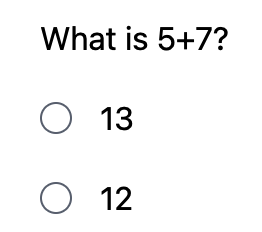

#### 2. MCA (Multiple Correct Answers)

A question with multiple correct answers. Candidates can select more than one option using checkboxes.

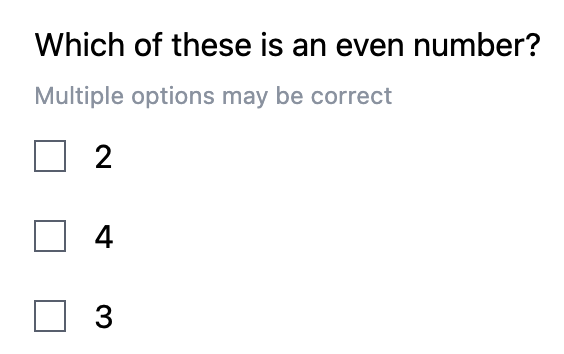

#### 3. Short Text

An essay-type question where you can set minimum and maximum character length for the response. Use this for open-ended answers that require more than a single line.

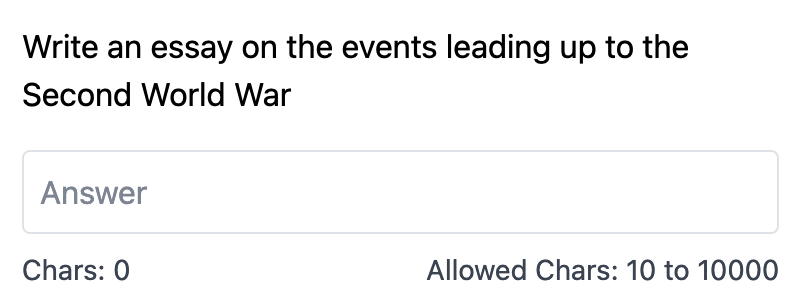

#### 4. Single-line Input

A compact text input field for shorter answers. You can set validations to accept only specific formats like emails, numbers, or dates.

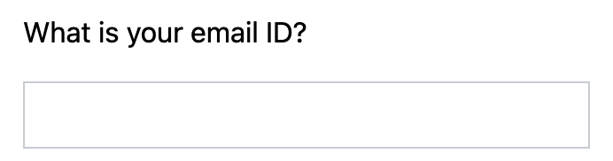

### Available on Premium and Elite Plans


The following question types require a **Premium** or **Elite** plan. See [Question Type Availability](socratease/create-questions/question-type-availability.md) for the full breakdown.


#### 5. Coding Editor

Candidates write code with syntax highlighting and autocomplete. You choose the programming language. The code cannot be executed -- this question type evaluates the candidate's ability to write code, not to run it.

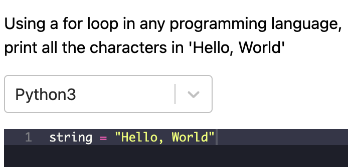

#### 6. Cloze (Fill-in-the-Blanks)

A fill-in-the-blank format where candidates see the available options (including wrong ones) and drag and drop them into the correct blanks within the text.

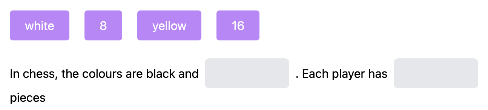

#### 7. Match

A matching exercise where candidates drag and drop items to align related pairs across two columns.

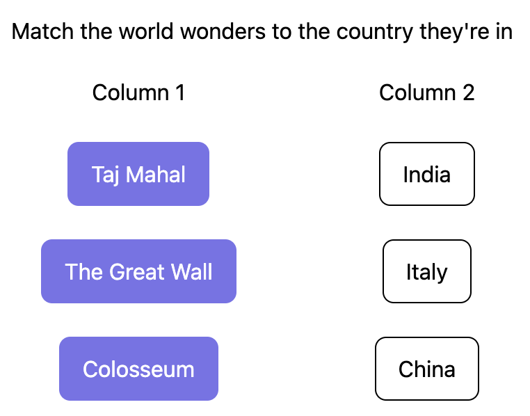

#### 8. Categorize

Candidates classify a set of items into the correct buckets or categories by dragging and dropping them.

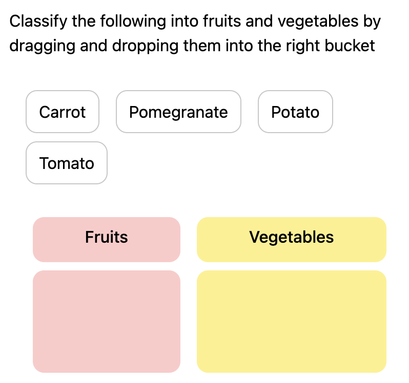

#### 9. Comprehension

A nested question format where you write a passage of text and ask multiple questions based on that passage. All sub-questions appear alongside the comprehension text.

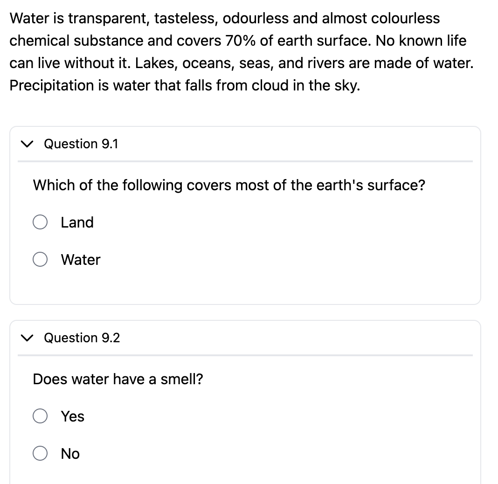

#### 10. Document

Upload a PDF document and ask multiple questions based on its content. Candidates view the document alongside the questions.

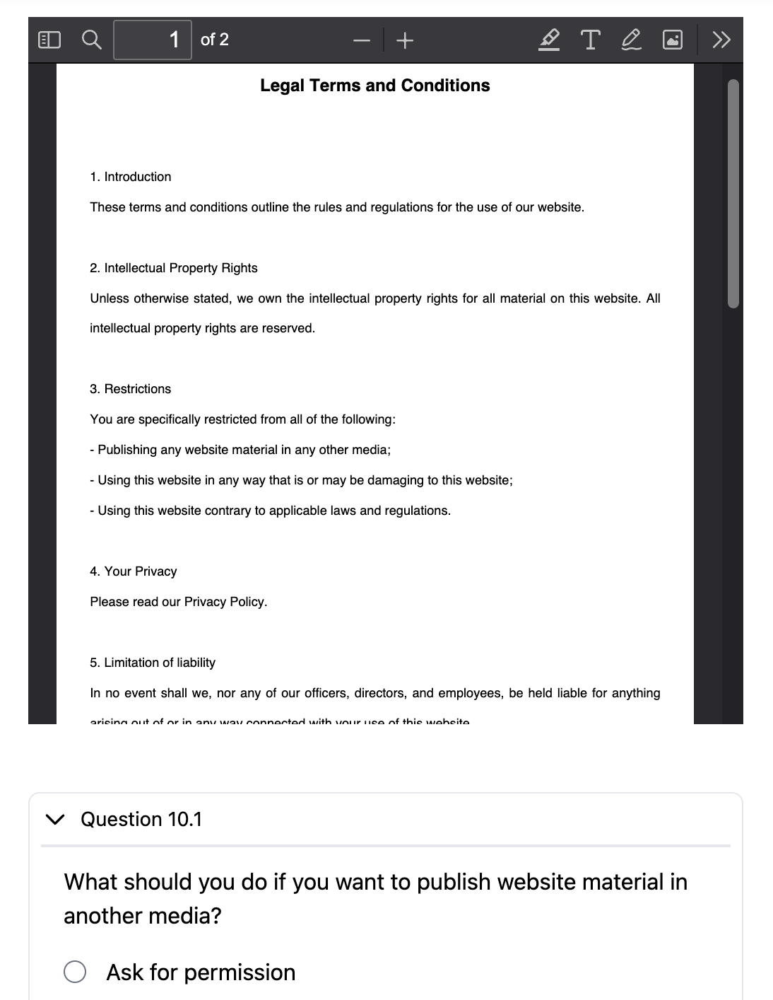

### Available on Elite Plan Only


The following question types are exclusive to the **Elite** plan. See [Elite Features](pricing-account/plans-credits/elite-features.md) for more about Elite plan capabilities.


#### 11. Answer Any

You create a set of questions (for example, 5) and let candidates choose a subset to answer (for example, any 3 out of the 5). This gives candidates flexibility while maintaining assessment rigor.

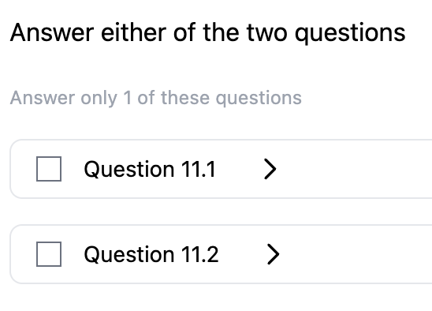

#### 12. Voice Input

You type a piece of text and candidates record themselves speaking that text. This is useful for language assessments, pronunciation evaluations, and oral communication testing.

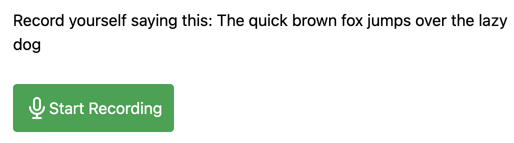

#### 13. Autograded Text

You type the question text and the expected answer. The candidate's response is automatically marked as correct if it matches the expected answer exactly. This enables instant grading without manual review.

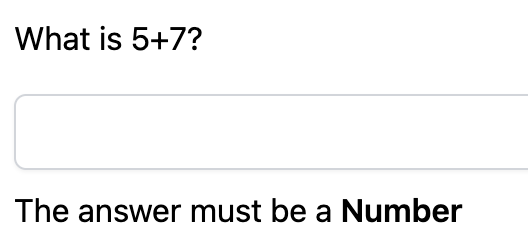

### Related Resources

* [Question Type Availability](socratease/create-questions/question-type-availability.md) -- Which question types are available on your plan
* [How to Create a Socratease Quiz](socratease/create-questions/creating-a-quiz.md) -- Step-by-step creation guide
* [Quiz Settings](socratease/settings/quiz-settings.md) -- Configure your quiz behavior
* [Question Banks](socratease/create-questions/question-banks.md) -- Create randomized question pools
* [Bulk Import from Excel](socratease/create-questions/bulk-import-from-excel.md) -- Import MCQ and MCA questions in bulk
* [Elite Features](pricing-account/plans-credits/elite-features.md) -- Learn about Elite plan capabilities
