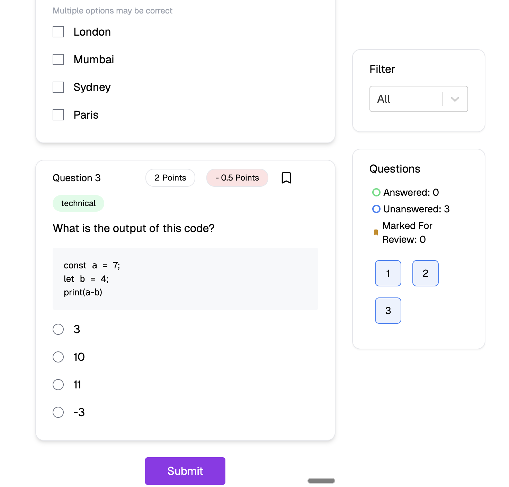
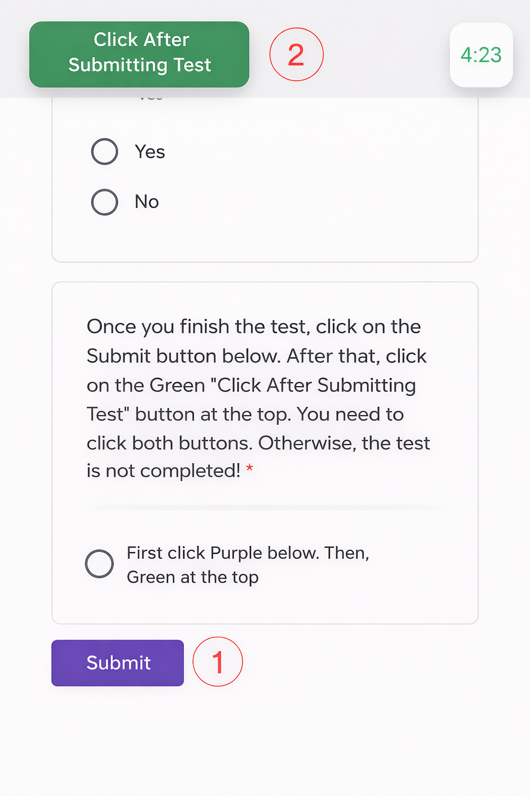

# Why Socratease Quiz?

Socratease is AutoProctor's purpose-built quizzing platform designed specifically for candidate evaluation. Unlike survey tools like Google Forms and Microsoft Forms, Socratease provides dedicated assessment features that reduce cheating, prevent answer loss, and streamline the entire testing workflow.

### Key Advantages

#### 1. Single Submit Button

Candidates click one [submit button](candidate-guide/attempting/submit-button.md) instead of two. This prevents answer loss from submission errors -- a common issue with other platforms where candidates may submit the form but forget to submit the proctored test (or vice versa).

 _Socratease: single submit button_

 

 _Other platforms: dual submit buttons_

#### 2. Multiple Question Types

Beyond standard multiple-choice and essays, Socratease supports:

* Voice responses
* PDF-based questions
* Drag-and-drop matching exercises
* Cloze (fill-in-the-blank)
* Categorization
* Coding editor
* And more

See the full list of [question types](socratease/create-questions/question-types.md).

#### 3. Auto-Submit Test Protection

Unlike competing tools, when a test auto-submits due to time expiry, **the answers are first submitted and then the test is closed**. This preserves candidate responses even if time expires, ensuring no work is lost.

#### 4. Disable Copy-Paste

You can prevent candidates from copying questions or pasting answers, reducing their reliance on external sources like ChatGPT or other AI tools.

#### 5. Single Dashboard

All functions -- test creation, answer review, and proctoring reports -- operate within AutoProctor's unified interface. You do not need to switch between multiple tools or platforms.

#### 6. Formatting and Equations

Socratease supports:

* **Negative points** for incorrect answers
* **Markdown formatting** for rich text in questions
* **LaTeX** for [mathematical equations](socratease/settings/latex-math-equations.md)
* **Question tagging** for [organizing and filtering results](socratease/settings/using-tags.md)

#### 7. Question Banks and Bulk Import

* [**Question Banks**](socratease/create-questions/question-banks.md): Create large pools of questions and have candidates receive a random subset, making each test unique.
* [**Bulk Import**](socratease/create-questions/bulk-import-from-excel.md): Import questions in bulk from Excel files, saving time when you have many questions to add.


Question Banks and Bulk Import are **Elite** plan features. See [Elite Features](pricing-account/plans-credits/elite-features.md) for details.


### Related Resources

* [How to Create a Socratease Quiz](socratease/create-questions/creating-a-quiz.md) -- Step-by-step creation guide
* [Question Types](socratease/create-questions/question-types.md) -- All 13 available question formats
* [Quiz Settings](socratease/settings/quiz-settings.md) -- Configure quiz behavior
* [Quiz Providers](tests-results/create/quiz-providers.md) -- Compare Socratease with other quiz platforms
* [Question Type Availability](socratease/create-questions/question-type-availability.md) -- Which question types are available on your plan
