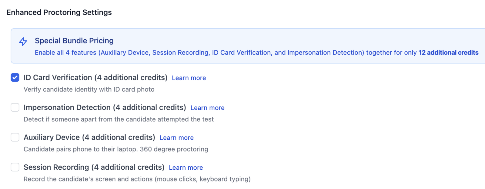
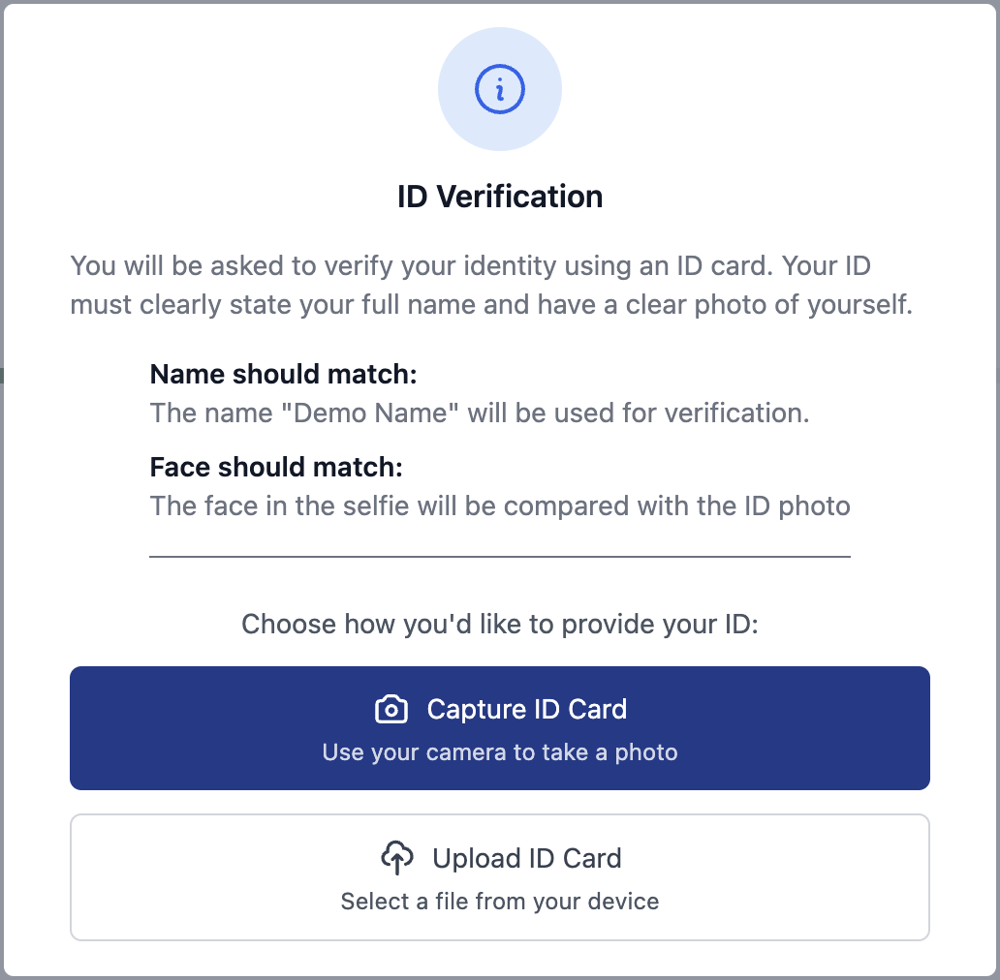
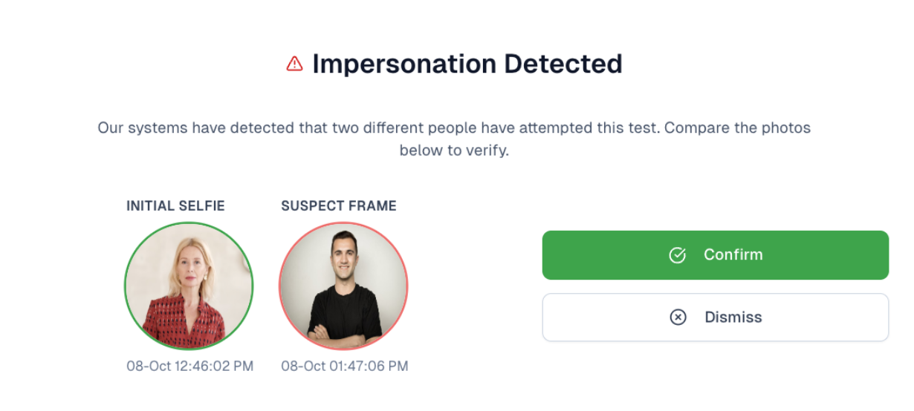
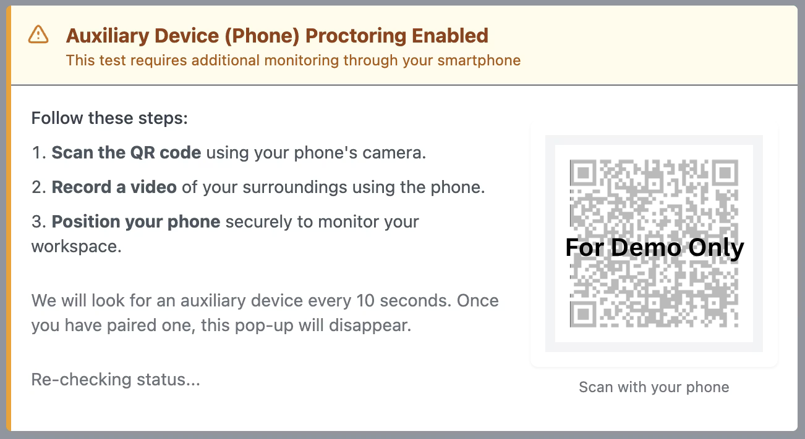
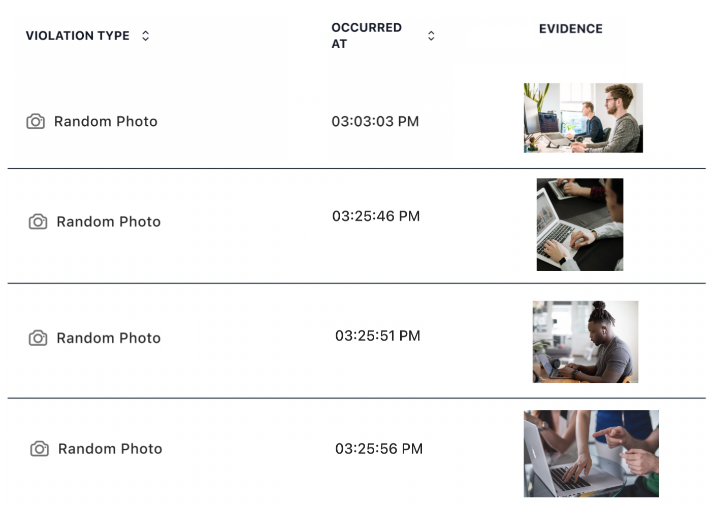

Enhanced Proctoring adds advanced identity verification and monitoring features beyond standard proctoring. These features help prevent impersonation, detect AI tools, and create a comprehensive record of each test attempt, including full candidate video.


Most enhanced proctoring features require **4 additional credits per attempt**. Candidate Video Recording costs **15 credits per attempt**. If you enable multiple enhanced features, the credit cost is cumulative.


## Available Features

### ID Card Verification

ID Card Verification confirms the candidate's identity by matching their uploaded ID against their test photo and entered name.



### Enable ID Card Verification
Toggle the **ID Card Verification** option in the Enhanced Proctoring section of your test settings.


### Candidate uploads their ID
When starting the test, the candidate is prompted to upload a photo of their ID card. Accepted documents include candidate ID cards, passports, driver's licenses, and government-issued IDs.


### AutoProctor verifies identity
The system compares the photo and name on the ID card against the Photo Before Test Start and the name the candidate entered on the platform.



*ID verification screen before test start*


**Photo Before Test Start** must be enabled in the basic proctoring settings for ID Card Verification to work effectively.


### Impersonation Detection

Impersonation Detection monitors whether someone other than the original candidate attempts or continues the test. AutoProctor compares periodic photos taken during the test against the initial photo to detect face changes.

*Impersonation evidence on report*

### Auxiliary Device (360° Proctoring)

The Auxiliary Device feature enables 360-degree proctoring by pairing the candidate's phone with their laptop. This provides a secondary camera angle that captures the candidate's physical environment.



### Enable Auxiliary Device
Toggle the **Auxiliary Device** option in Enhanced Proctoring settings.


### Candidate pairs their phone
When the test starts, the candidate scans a QR code on their laptop screen using their phone camera. This pairs the two devices.

*Auxiliary device pairing screen before test start*


### Phone provides secondary monitoring
The phone camera captures the candidate's desk, surroundings, and screen from a different angle. This also helps detect AI tools that display answers as overlays on the screen.



*Auxiliary device evidence captures*

### Session Recording

Session Recording captures a complete record of the candidate's screen activity throughout the test, including mouse clicks and keyboard input. This creates a reviewable timeline of the entire test attempt.

### Candidate Video Recording

Candidate Video Recording captures the candidate's full video from their webcam throughout the entire test. This lets the examiner watch the candidate's behavior during the test, providing the most complete evidence of test integrity.


Candidate Video Recording costs **15 credits per attempt** and is **not included** in the enhanced proctoring bundle discount.


[Try the enhanced proctoring demo](https://www.autoproctor.co/tests/aux-demo/) to see these features in action before enabling them on your test.

## Credit Cost Summary

| Feature | Credits per Attempt |
|---|---|
| ID Card Verification | 4 |
| Impersonation Detection | 4 |
| Auxiliary Device (360°) | 4 |
| Session Recording | 4 |
| Candidate Video Recording | 15 |
| All 4 features combined (excl. Video) | 12 (25% bundle discount) |


The 25% bundle discount applies when you enable ID Card Verification, Impersonation Detection, Auxiliary Device, and Session Recording together. Candidate Video Recording is billed separately at 15 credits per attempt.


## Related Resources

- [Proctoring Settings](tests-results/create/proctoring-settings.md) — Basic proctoring options (camera, microphone, tab switching)
- [Trust Score](understanding/how-proctoring-works/trust-score.md) — How enhanced proctoring data affects the trust score
- [Proctoring Results](tests-results/results/proctoring-results.md) — Reviewing enhanced proctoring results
- [Access Answers and Candidate Responses](tests-results/results/individual-submissions.md) — Viewing detailed data for each candidate
- [Payments and Credits](pricing-account/plans-credits/payments-and-credits.md) — Understanding credit usage and purchasing
- [Elite Features](pricing-account/plans-credits/elite-features.md) — Overview of premium and elite features
