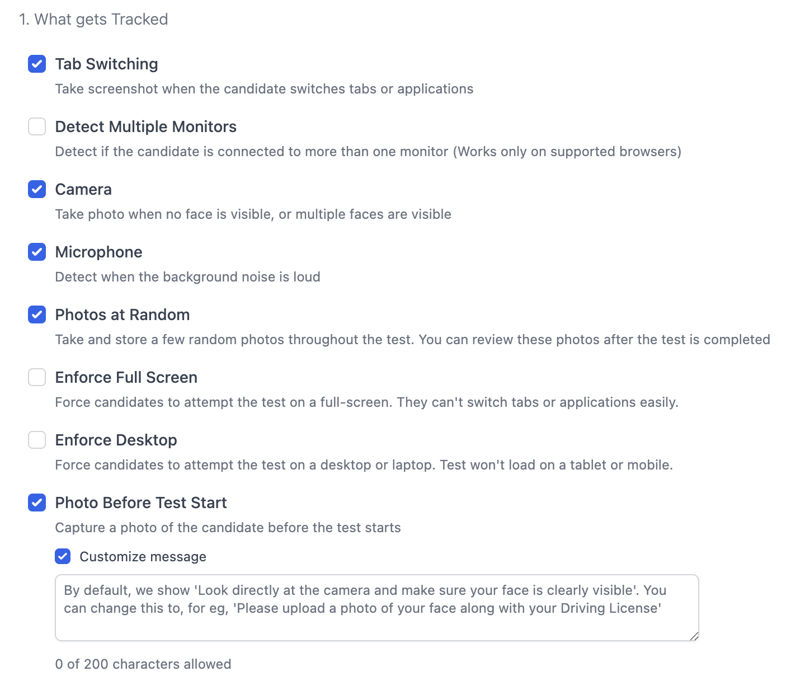
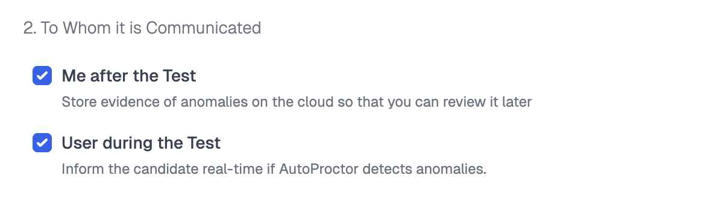


You must check the **Enable Proctor** checkbox in Main Settings for any of these settings to apply. If proctoring is disabled, candidates take the test without monitoring.


## Basic Proctoring Options

*Proctoring settings panel*

| Setting | What It Does |
|---|---|
| **Tab Switching** | Detects when a candidate switches to a different browser tab or application. Captures a screenshot of the tab they switched to. |
| **Detect Multiple Monitors** | Detects if a candidate has connected external monitors. |
| **Camera** | Detects if no face is visible, or if multiple faces are visible. Captures photos as evidence. |
| **Microphone** | Monitors the sound environment and records audio when noise is detected. |
| **Photos at Random** | Captures random photos throughout the test at randomized intervals. |
| **Enforce Full Screen** | Forces candidates to take the test in full screen mode. Exiting full screen is recorded as a violation. |
| **Enforce Desktop** | Requires a desktop or laptop computer. The test will not load on tablets or mobile devices. |
| **Photo Before Test Start** | Captures a photo of the candidate before the test begins. |
| **Customize Message** | Customize the message candidates see when asked for a photo. Use this to ask candidates to display their ID card. |


**Customize Message** is a Premium feature. See [Feature Comparison](pricing-account/plans-credits/feature-comparison.md) for plan details.


## Enhanced Proctoring


Enhanced proctoring adds ID verification, impersonation detection, 360° auxiliary camera, session recording, and candidate video recording. See [Enhanced Proctoring](tests-results/create/enhanced-proctoring.md) for the full setup guide and credit costs.


## Communication Settings

These settings control how violation evidence is handled and whether candidates are notified:

| Setting | What It Does | Recommendation |
|---|---|---|
| **Me after the Test** | Stores evidence (photos, audio, screenshots) for your review after the test ends. | **Keep enabled** — you need this to review violations. |
| **User during the Test** | Notifies the candidate during the test when a violation is detected. | **Keep enabled** — helps candidates fix harmless issues like background noise. |

*Communication settings panel*

## Related Resources

- [Timer Settings](tests-results/create/timer-settings.md) — Configure test duration and time windows
- [Enhanced Proctoring](tests-results/create/enhanced-proctoring.md) — Detailed guide on ID verification, impersonation detection, and 360° proctoring
- [What Gets Tracked](understanding/how-proctoring-works/what-gets-tracked.md) — Complete list of everything AutoProctor monitors
- [Proctoring Results](tests-results/results/proctoring-results.md) — How to review proctoring data after a test
- [Trust Score](understanding/how-proctoring-works/trust-score.md) — How the trust score is calculated from proctoring data
