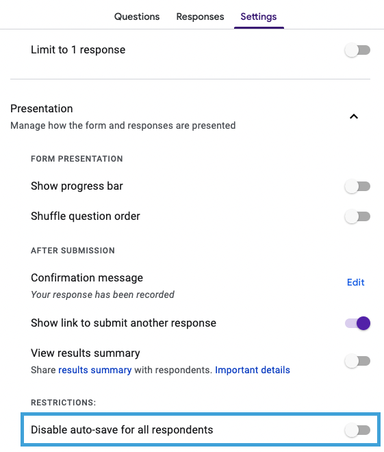
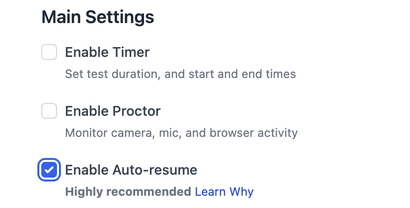
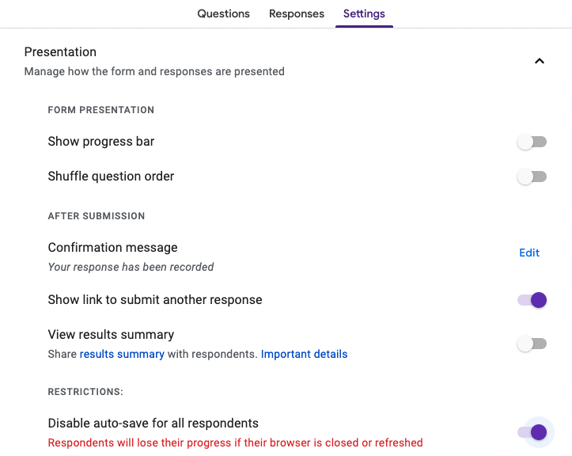
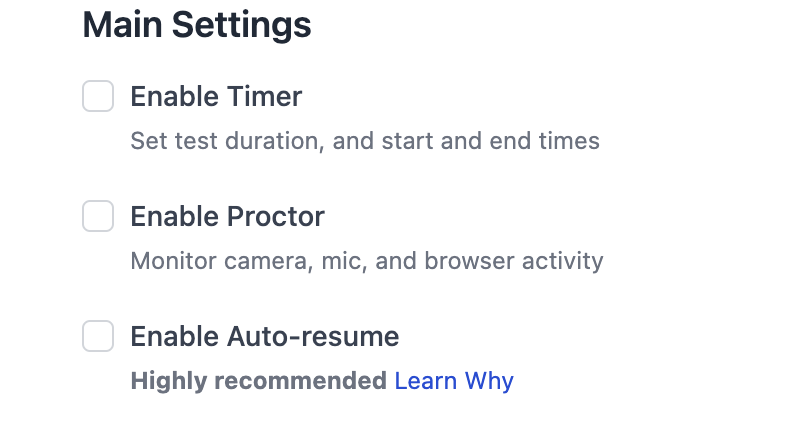

# Resuming Google Forms Tests

Google Forms tests require two settings to work together for correct resume behavior: the **autosave** setting in Google Forms and the **auto-resume** setting in AutoProctor. Mismatching these settings causes unexpected behavior for candidates.


Two settings control Google Forms test resumption:

1. **Disable Autosave** in Google Forms -- Controls whether draft responses are saved as the candidate fills out the form.
2. **Enable Auto-resume** in AutoProctor -- Controls whether AutoProctor loads the previous attempt when a candidate returns to the test link.

You must configure both settings together for the intended behavior.


### To Allow Test Resumption

If you want candidates to pick up where they left off after closing the test:



#### Keep autosave enabled in Google Forms

Make sure the **Disable Autosave** feature is **OFF** in your Google Forms test settings. This is the default setting, so you only need to verify it has not been changed.




#### Enable auto-resume in AutoProctor

Turn on the **Enable Auto-resume** setting in your AutoProctor test settings.




### To Prevent Test Resumption

If you want each visit to the test link to create a new, blank attempt:



#### Disable autosave in Google Forms

Turn **ON** the **Disable Autosave** feature in your Google Forms test settings. This prevents Google Forms from saving draft responses.




#### Disable auto-resume in AutoProctor

Turn **OFF** the **Enable Auto-resume** option in your AutoProctor test settings.




### Settings Combination Reference

| Disable Autosave (Google Forms) | Enable Auto-resume (AutoProctor) | Result                                                                                                            |
| ------------------------------- | -------------------------------- | ----------------------------------------------------------------------------------------------------------------- |
| OFF (default)                   | ON (default)                     | Candidates resume where they left off                                                                             |
| ON                              | OFF                              | Each visit starts a fresh, blank attempt                                                                          |
| OFF                             | OFF                              | New attempt loads, but Google Forms may show previously saved answers -- confusing for candidates                 |
| ON                              | ON                               | AutoProctor tries to resume, but Google Forms has no saved draft -- candidate sees a blank form with reduced time |


If the two settings are mismatched (for example, autosave is enabled but auto-resume is disabled), candidates may experience unexpected behavior such as seeing a partially filled form on a new attempt or losing their saved progress. Always configure both settings to match.


### Default Settings

Google Forms has autosave enabled by default, and AutoProctor's corresponding default setting allows resuming unsubmitted test attempts. This means tests resume by default unless you explicitly change either setting.

### Related Resources

* [Resuming Test Attempts](tests-results/create/resuming-test-attempts.md) -- General resume behavior across all test types
* [Maximum Attempts](tests-results/access-limits/maximum-attempts.md) -- Configure how many attempts candidates are allowed
* [Unsubmitted Tests](tests-results/results/unsubmitted-tests.md) -- View tests started but not submitted
* [Timer Settings](tests-results/create/timer-settings.md) -- Configure test duration and time windows
* [Best Practices for Test Creators](understanding/getting-started/best-practices-for-teachers.md) -- Tips for smooth test administration
