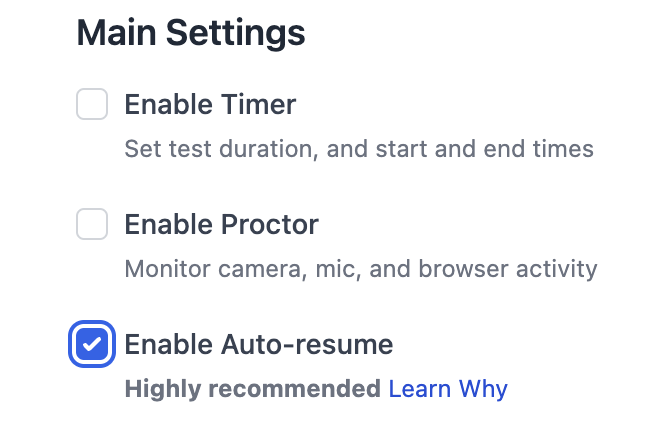

# Resuming Test Attempts


**Resuming** means any way the candidate returns to the test: clicking the test link again, reloading the page in the browser, or coming back after a while and letting the browser auto-reload.


When a candidate leaves a test mid-attempt — whether due to a browser crash, network issue, or accidental closure — AutoProctor determines whether to resume the previous attempt or create a new one. The behavior depends on your test type and settings.

### Resume Behavior by Test Type

| Test Type       | Resume Behavior | Details                                                                                                         |
| --------------- | --------------- | --------------------------------------------------------------------------------------------------------------- |
| Socratease Quiz | Always resumes  | Loads previous responses automatically; candidates must complete the existing attempt before starting a new one |
| Microsoft Forms | Never resumes   | Creates a new attempt each time due to platform limitations                                                     |
| Google Forms    | Configurable    | Controlled by the **Enable Auto Resume** toggle and Google Forms autosave setting                               |
| IFrame Tests    | Configurable    | Controlled by the **Enable Auto Resume** toggle                                                                 |

### Configuring the Resume Feature

For Google Forms and IFrame tests, you control resume behavior through the **Enable Auto Resume** toggle in your test settings.



#### Open test settings

Navigate to your test on the [AutoProctor dashboard](https://www.autoproctor.co/test-admin/home/) and click **Settings**.



#### Toggle Enable Auto Resume

Find and enable or disable the **Enable Auto Resume** option.





For Google Forms, you must also keep the **Save Draft** (autosave) setting enabled in Google Forms itself for resume to work properly. See [Resuming Google Forms Tests](tests-results/create/resuming-google-forms.md) for detailed configuration.


### How Resumption Works

When a candidate returns to the test after disconnecting:

* **If resume is enabled**: AutoProctor reopens the previous attempt. For **Socratease** quizzes, prior responses are restored automatically. For **IFrame** and **Google Forms** tests, whether responses are preserved depends on the external quiz platform's own save/autosave behavior.
* **If resume is disabled**: AutoProctor creates a new, blank attempt. The incomplete attempt still appears in your results.

### How Timers Interact with Resumption

If you have [timer settings](tests-results/create/timer-settings.md) configured, they affect how resumption works.

#### Test Duration

The remaining time from the original attempt carries over. For example, if a candidate starts a 60-minute test at 10:00 AM and disconnects at 10:30 AM, resuming at 10:50 AM gives them only 10 minutes remaining. Once the full duration expires (11:00 AM), the test can no longer be resumed.

#### Cannot Start Before / Cannot Start After

These constraints apply to the original start time, not the reconnection time. A candidate who started before the deadline can still resume after it, as long as the test duration has not expired.

#### Must Submit By

This deadline is strictly enforced at reconnection time. If the **Must Submit By** deadline has passed before the candidate tries to resume, the test does not load -- even if the candidate originally started before the deadline.


The **Must Submit By** deadline overrides all other timer settings at resumption time. If this deadline has passed, the candidate cannot resume regardless of remaining test duration.


### Related Resources

* [Resuming Google Forms Tests](tests-results/create/resuming-google-forms.md) -- Detailed Google Forms resume configuration
* [Maximum Attempts](tests-results/access-limits/maximum-attempts.md) -- How attempt limits interact with resumption
* [Unsubmitted Tests](tests-results/results/unsubmitted-tests.md) -- View details of tests started but not submitted
* [Timer Settings](tests-results/create/timer-settings.md) -- Configure test duration, deadlines, and time windows
* [Best Practices for Test Creators](understanding/getting-started/best-practices-for-teachers.md) -- Tips for smooth test administration
