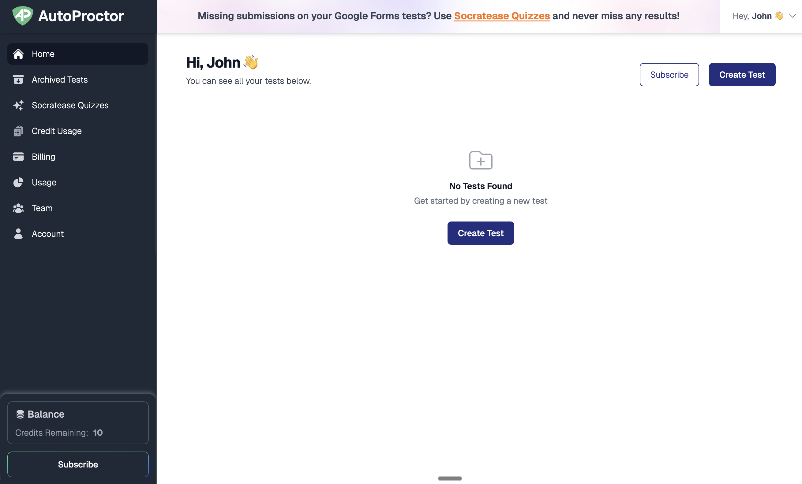
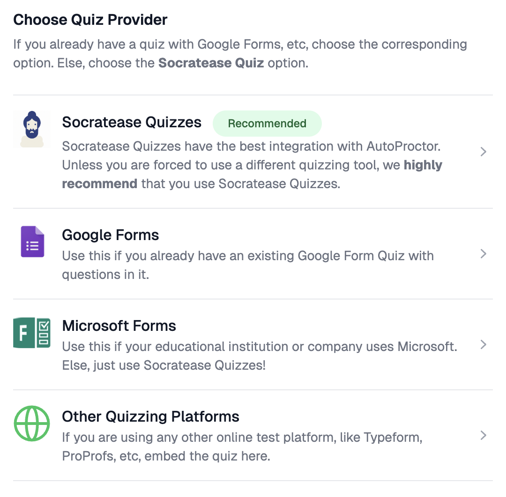
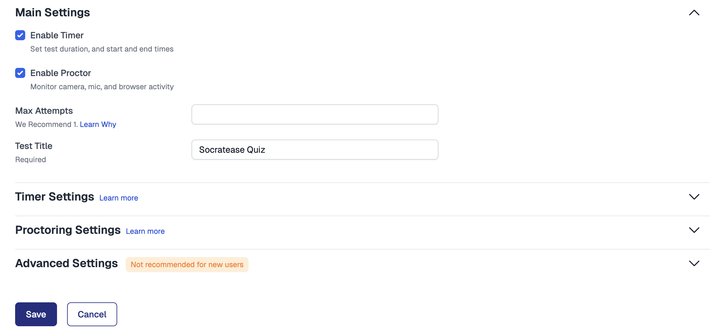
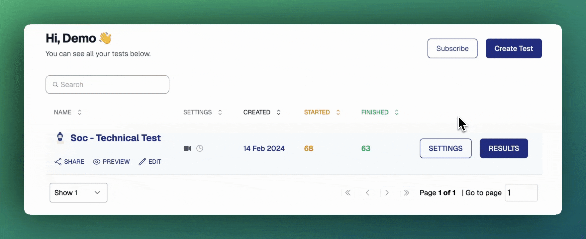

# Your First Proctored Test


Create a proctored test, share the link with candidates, and view results — all in under 5 minutes.


### Create Your First Test



#### Log in to AutoProctor

Go to [autoproctor.co](https://www.autoproctor.co/) and sign in with your **Google** or **Microsoft** account. You'll land on your dashboard, where all your tests are listed.

 _AutoProctor dashboard for a new user_



#### Create a new test

Click **Create Test** on your dashboard. Choose a quiz provider:

| Provider            | When to Use                                            |
| ------------------- | ------------------------------------------------------ |
| **Google Forms**    | You already have a Google Form                         |
| **Microsoft Forms** | You already have a Microsoft Form                      |
| **Socratease**      | You want to create a quiz directly on AutoProctor      |
| **IFrame**          | You use another platform (TypeForm, ClassMarker, etc.) |

 _Quiz provider selection screen_

Select your provider and follow the prompts to connect your quiz.



#### Configure test settings

Click **Settings** on the test to configure:

* **Main Settings** — Enable the timer and proctoring, set [maximum attempts](tests-results/access-limits/maximum-attempts.md), and name your test
* [**Timer Settings**](tests-results/create/timer-settings.md) — Set a duration, start window, and submission deadline
* [**Proctoring Settings**](tests-results/create/proctoring-settings.md) — Enable camera, microphone, tab-switching detection, and more
* [**Advanced Settings**](tests-results/create/advanced-settings.md) — Choose login methods and add restrictions

 _Test settings page with key sections_


For your first test, the default proctoring settings work well. You can fine-tune them later based on your needs.




#### Test the link yourself

Before sharing, click the test link yourself to verify the candidate experience. Confirm that the **instructions page**, **camera check**, and **proctoring setup** all load correctly.



#### Share the test link

Copy the test link from your dashboard and share it with candidates via:

* **Email** — or use [Invite via Email](tests-results/access-limits/inviting-candidates-via-email.md) for direct invitations
* **Your LMS** or classroom platform
* **Any messaging tool**

 _Copying the test link from the dashboard_



#### View results

Once candidates complete the test, go to your [dashboard](https://www.autoproctor.co/test-admin/home/) and click **Results** to see:

* **Trust scores** for each candidate
* **Proctoring violation** details
* **Photos, recordings, and evidence**
* **Quiz scores** (only if you used Socratease)

 _Sample results page showing submissions, trust scores, and quiz scores_

For a detailed guide, see [Where Can I See My Quiz Results?](tests-results/results/how-to-see-results.md).



### Related Resources

* [Quiz Providers](tests-results/create/quiz-providers.md) — All supported quiz platforms
* [Timer Settings](tests-results/create/timer-settings.md) — Configure test duration and time windows
* [Proctoring Settings](tests-results/create/proctoring-settings.md) — Configure what gets monitored
* [FAQs](understanding/getting-started/faqs.md) — Common questions about AutoProctor
* [Best Practices for Test Creators](understanding/getting-started/best-practices-for-teachers.md) — Tips for running proctored tests
