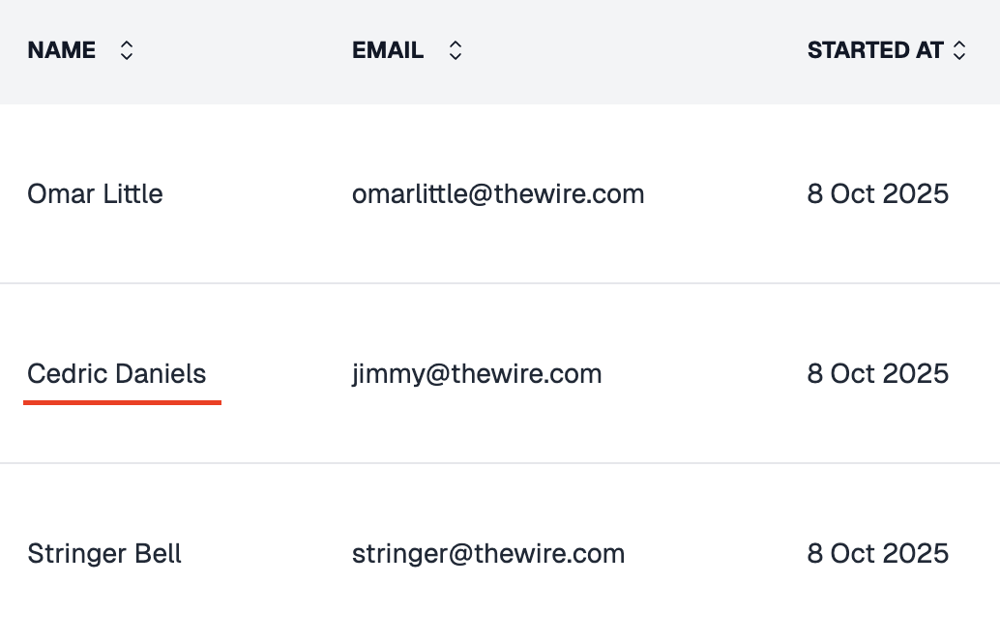

AutoProctor does not ask candidates to type their name directly. Instead, it pulls the name from the account used to sign in. If a candidate's name appears incorrectly in results, the issue originates from their account profile -- not from AutoProctor.

## Why This Happens

AutoProctor retrieves candidate names from the authentication provider they used to sign in:

| Sign-in Method | Name Source |
|---|---|
| Google account | Display name set in [Google Account settings](https://myaccount.google.com/personal-info) |
| Microsoft account | Display name set in [Microsoft Account settings](https://account.microsoft.com/profile) |

If the name on their Google or Microsoft account is incorrect, misspelled, or uses a nickname, that same name will appear in AutoProctor results.


AutoProctor pulls candidate names directly from their account profile. If the name is wrong in results, the candidate needs to update their profile on AutoProctor directly.


*Example of an incorrect candidate name displayed in AutoProctor results*

## How to Fix It



### Identify the candidate's email
Find the email address associated with the candidate's test attempt on the results page.


### Direct the candidate to update their profile
Have the candidate visit [autoproctor.co/account/edit-profile](https://www.autoproctor.co/account/edit-profile/) and update their name. Share this link with the candidate along with a note identifying which email address needs the correction.


### Verify the change
Once the candidate updates their name on their AutoProctor profile, the change automatically reflects across all existing test reports. No further action is needed from the test administrator.



## Related Resources

- [Proctoring Results](tests-results/results/proctoring-results.md) -- How to review proctoring reports
- [How to Logout](candidate-guide/attempting/how-to-logout.md) -- Switch accounts if the wrong one was used
- [Candidate Login Methods](candidate-guide/attempting/candidate-login-methods.md) -- Understand sign-in options
- [Instructions for Taking a Proctored Test](candidate-guide/attempting/proctored-test-instructions.md) -- Setup guide for candidates
- [Contact Us](pricing-account/support/contact-us.md) -- Reach out if you need further help
