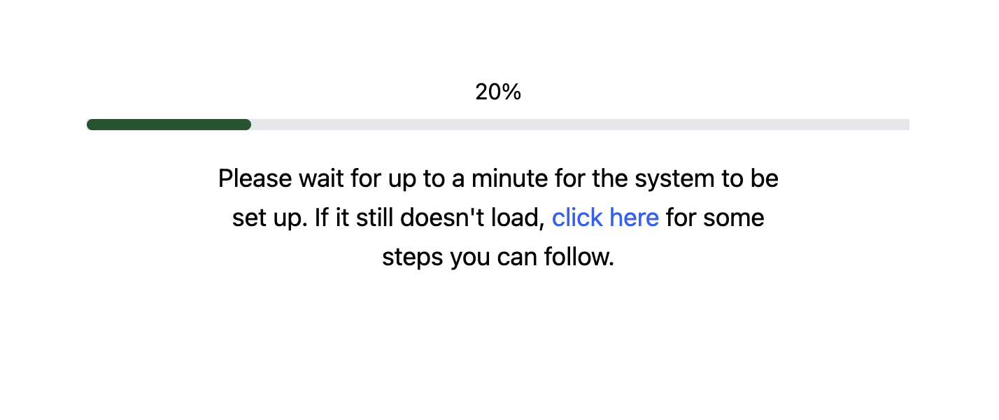

AutoProctor uses advanced browser technologies for real-time proctoring, which require a modern browser and adequate device hardware. If your test is stuck at the loading screen, your setup likely does not meet these requirements.

## Why Your Test Is Stuck at Loading

AutoProctor runs AI-powered video capture and analysis directly in your browser. This demands significantly more processing power than typical web applications. The loading screen appears when your browser or device cannot initialize these proctoring components.

Common causes include:

- **Outdated browser** -- older browser versions lack the APIs AutoProctor needs
- **Insufficient hardware** -- low-end or older devices may not support real-time video processing
- **Browser extensions** -- certain extensions (especially ad blockers and privacy tools) can block AutoProctor's scripts from loading

*AutoProctor loading screen indicating a compatibility issue*

## How to Fix It



### Take the demo test
Visit the [AutoProctor demo test](https://www.autoproctor.co/tests/bj0yv14Ufu/?timer=True&proctor=True) to verify that your device and browser are compatible. If the demo also fails to load, your device does not support AutoProctor.


### Use a modern browser
Ensure you are running the latest version of **Google Chrome** (version 83+) on Windows, Android, or Mac, or **Safari** (version 13+) on iPhone or iPad. Update your browser if it is not current.


### Disable conflicting extensions
Temporarily disable browser extensions, especially ad blockers and privacy tools, that may interfere with AutoProctor's scripts.


### Close other applications
Close all unnecessary applications and browser tabs to free up processing power and memory for AutoProctor.


### Switch to a different device if needed
If the test still does not load after following the steps above, your device does not meet the minimum hardware requirements. You will need to switch to a more powerful device. Your device may run everyday apps like YouTube and social media perfectly, but AutoProctor's AI processing demands significantly more resources.




If the demo test also fails to load, your device does not support AutoProctor. You will need to use a different device with better hardware specifications. There is nothing AutoProctor can do from its end to resolve hardware limitations.



If one test loads on your device, all other tests will load too. The demo test is the best way to verify compatibility.


## Related Resources

- [Device Compatibility](understanding/getting-started/device-compatibility.md) -- Check supported browsers and minimum device specs
- [Test is Slow and Laggy](tests-results/issues/slow-and-laggy.md) -- Troubleshoot performance issues
- [Blank Page or Grey Screen](tests-results/issues/blank-page-grey-screen.md) -- Fix blank screen issues
- [Instructions for Taking a Proctored Test](candidate-guide/attempting/proctored-test-instructions.md) -- Setup guide for candidates
- [Contact Us](pricing-account/support/contact-us.md) -- Reach out if you need further help
