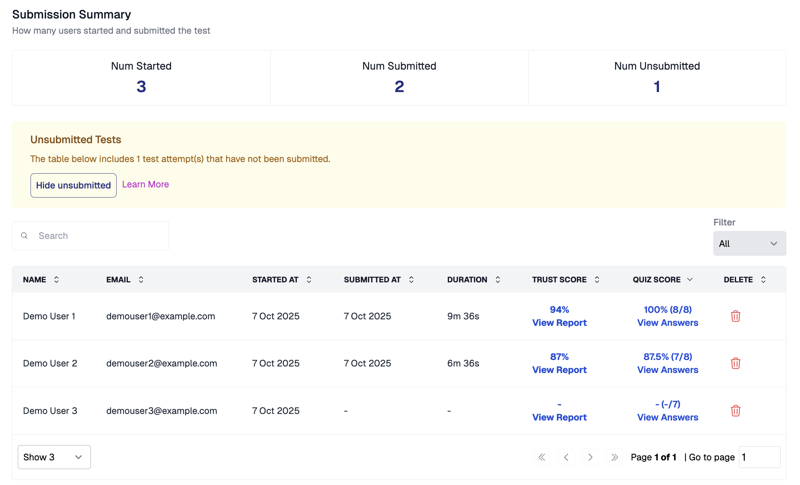

AutoProctor provides two distinct types of results for every test: **quiz results** (how candidates performed) and **proctoring results** (whether candidates maintained integrity).

*Results page showing Trust Score column*

## Quiz Results

Quiz results show each candidate's answers and scores. Unless you use Socratease Quizzes, these results appear in your original quiz platform — not on the [AutoProctor dashboard](https://www.autoproctor.co/test-admin/home/).


Unless you use Socratease Quizzes, you cannot view quiz results directly on AutoProctor. Quiz results appear in the platform where you created the quiz.


| Quiz Platform | Where to Find Quiz Results |
|---|---|
| **Google Forms** | Open your Google Form and click the **Responses** tab to see all submissions |
| **Microsoft Forms** | Check the **Responses** section in Microsoft Forms as you normally would |
| **IFrame Tests** | View results in the platform you embedded within the IFrame |
| **Socratease Quizzes** | View results directly on your [AutoProctor dashboard](https://www.autoproctor.co/test-admin/home/) under the test's **Results** section |


If you use Google Forms and cannot see responses, refer to the troubleshooting guide on [missing Google Forms responses](tests-results/issues/google-forms-response-not-visible.md).


## Proctoring Results

As a candidate takes the test, AutoProctor monitors their testing environment and records evidence of possible cheating or malpractice. This data compiles into a proctoring report with a [Trust Score](understanding/how-proctoring-works/trust-score.md).


Proctoring results are only available when you enable proctoring in your [test settings](tests-results/create/proctoring-settings.md). Tests configured with only a timer do not generate proctoring reports.


To learn how to access proctoring results step by step, see [Where Can I See Proctoring Results?](tests-results/results/proctoring-results.md).

## Related Resources

- [Where Can I See Proctoring Results?](tests-results/results/proctoring-results.md) -- Step-by-step guide to viewing proctoring reports
- [Access Answers and Candidate Responses](tests-results/results/individual-submissions.md) -- View specific candidate responses and scores
- [Export to Excel](tests-results/results/export-to-excel.md) -- Download results as a spreadsheet
- [Trust Score Explained](understanding/how-proctoring-works/trust-score.md) -- Understand how Trust Scores are calculated
- [What Gets Tracked](understanding/how-proctoring-works/what-gets-tracked.md) -- Learn what AutoProctor monitors during a test
