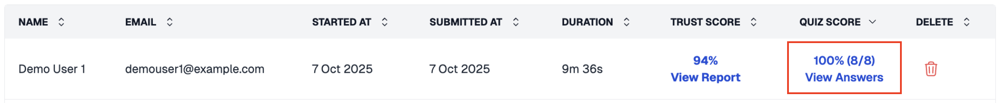
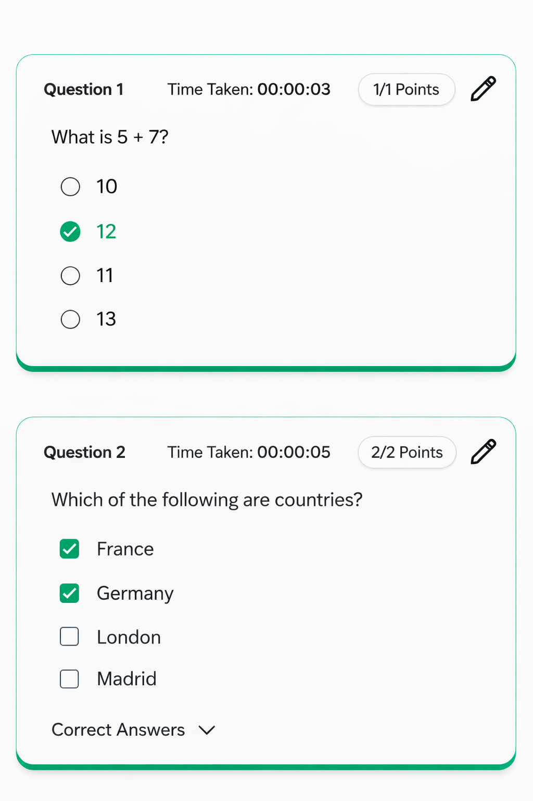

# Access Answers and Candidate Responses

After candidates complete a test, you can review their individual submissions to see detailed responses, scores, and grading status. The process differs depending on which quiz platform you use.

### For Socratease Quizzes



#### Go to your dashboard

Visit your [AutoProctor dashboard](https://www.autoproctor.co/test-admin/home/) and locate the test you want to review.



#### Click View under Results

Click the **View** button under the **Results** section of the relevant test. This opens a list of all candidate submissions.

 _Click on View Answers for individual responses_



#### Check scores and responses

Each submission shows one of two states:

| State                          | What It Means                                                          | Action                                              |
| ------------------------------ | ---------------------------------------------------------------------- | --------------------------------------------------- |
| **Score link with percentage** | The candidate finished the test and it has been graded                 | Click the score link to view their full responses   |
| **Blue Grade button**          | The candidate has not finished the test, or it has not yet been graded | Click **Grade** to review and grade their responses |

Clicking either link opens a detailed page showing all responses, points scored, and candidate-specific information.

 _Individual submission detail page with responses and scores_




For Google Forms, Microsoft Forms, and IFrame tests, quiz results appear in the platform where you created the quiz — not on AutoProctor. See [Where Can I See My Quiz Results?](tests-results/results/how-to-see-results.md) for where to find results for each platform.


### Related Resources

* [Where Can I See My Quiz Results?](tests-results/results/how-to-see-results.md) -- Overview of quiz results vs. proctoring results
* [Where Can I See Proctoring Results?](tests-results/results/proctoring-results.md) -- View proctoring reports for candidates
* [Export to Excel](tests-results/results/export-to-excel.md) -- Download all results as a spreadsheet
* [Showing Results to Candidates](socratease/settings/showing-results-to-candidates.md) -- Control what candidates see after submission
* [Google Sheets Integration](tests-results/results/google-sheets-integration.md) -- Automatically sync results to a Google Sheet
