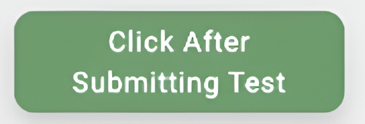
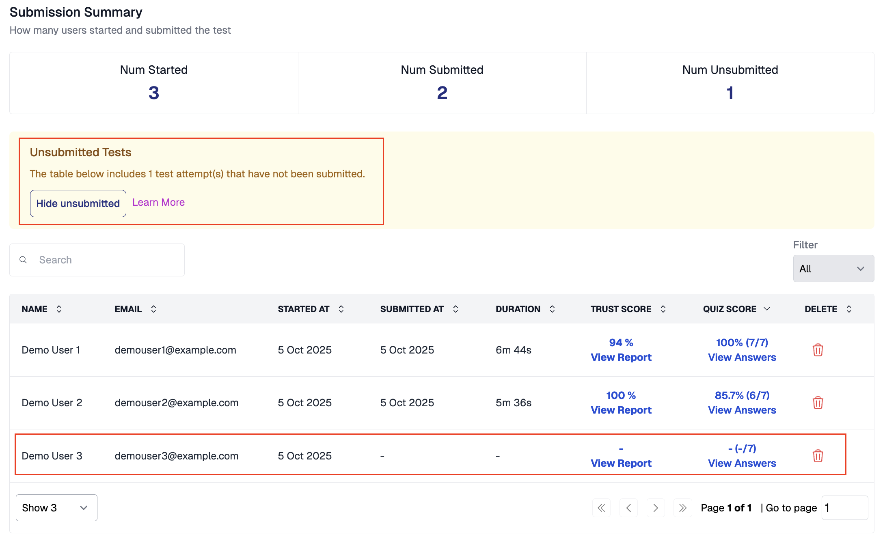
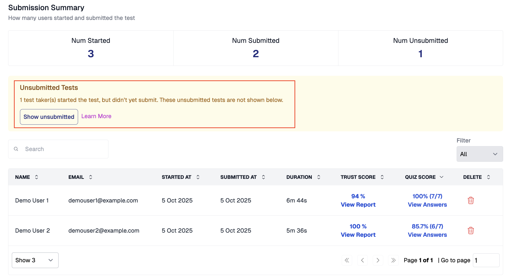
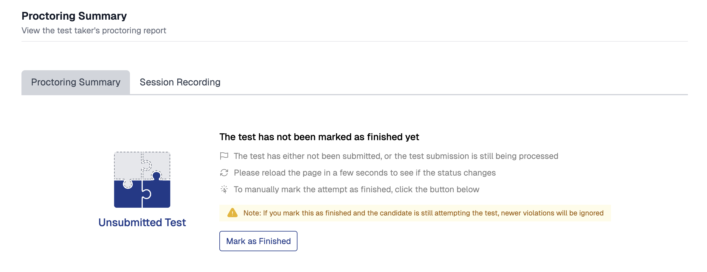
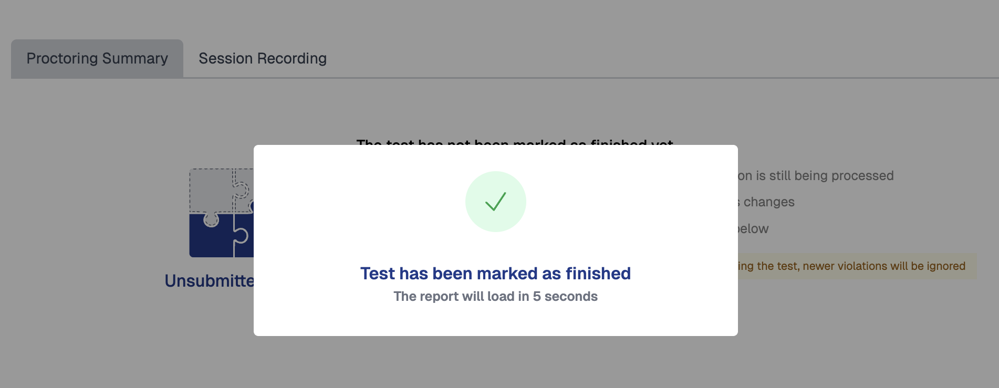
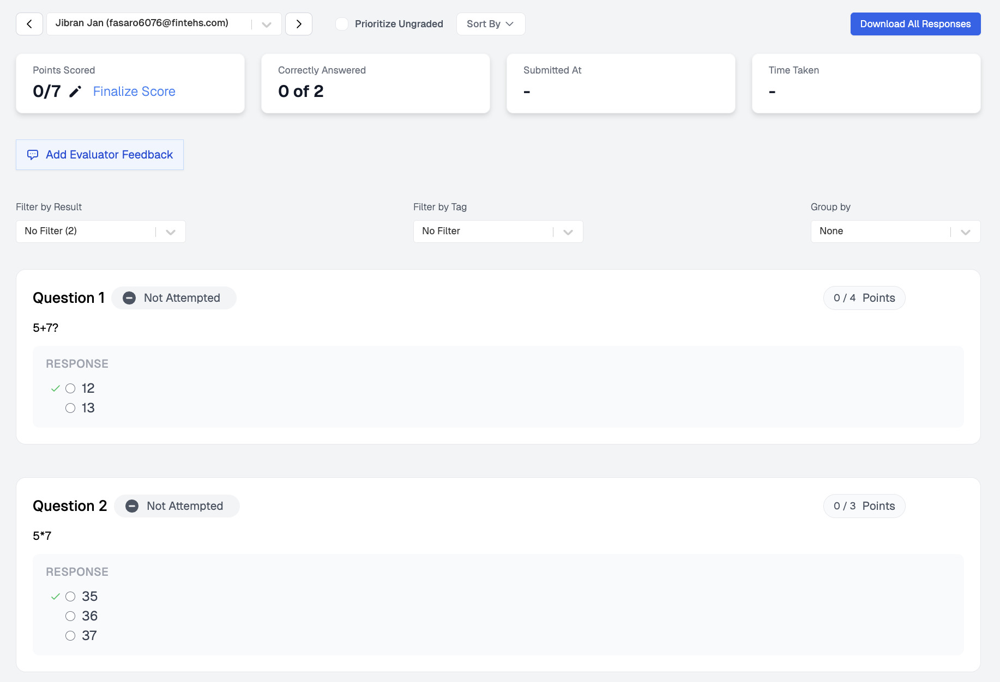

# View Unsubmitted Tests

An unsubmitted test occurs when a candidate starts a test but does not click the green **Submit** button at the top of the test window. The candidate may have viewed questions and entered answers, but their test was never formally submitted.

 _The green Submit button candidates must click_

### Viewing Unsubmitted Tests on the Results Page

When you open the results page for a test, unsubmitted tests are included alongside submitted results by default. A yellow banner at the top indicates that the table includes unsubmitted test attempts.

 _Results page showing unsubmitted tests_

To view only submitted results, click the **Hide unsubmitted** button in the yellow banner. The unsubmitted entries are removed from the table, and the button changes to **Show unsubmitted** so you can bring them back at any time.

 _Results page with unsubmitted tests hidden_

### Proctoring Report for an Unsubmitted Test

When you click **View Report** for an unsubmitted test attempt, you see a page indicating that the test has not been marked as finished yet. Proctoring results are not available until the attempt is marked as finished.

 _Proctoring report for an unsubmitted test_

To generate the proctoring report, click the **Mark as Finished** button. A confirmation message appears and the report loads automatically after a few seconds.

 _Confirmation after marking a test as finished_


If you mark a test as finished and the candidate is still attempting the test, newer violations will be ignored.


### Quiz Answers for an Unsubmitted Test

When you click **View Answers** for an unsubmitted test, the individual results page shows all questions as **Not Attempted** with 0 points scored.

 _Quiz answers for an unsubmitted test_

### Related Resources

* [Resuming Test Attempts](tests-results/create/resuming-test-attempts.md) -- How test resumption works when candidates leave mid-test
* [Where Can I See Proctoring Results?](tests-results/results/proctoring-results.md) -- View submitted proctoring reports
* [Before You Get Started](understanding/getting-started/things-you-need-to-know.md) -- Critical requirements including the submit button process
* [Where Can I See My Quiz Results?](tests-results/results/how-to-see-results.md) -- Overview of quiz results vs. proctoring results
