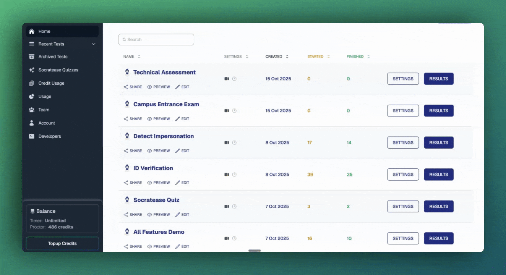

## Pre-Test Checklist



### Have candidates complete a demo test
Share the demo test link for your test type with candidates at least **24 hours** before the actual exam. The demo helps candidates understand the platform, grant the required browser permissions, and confirm their device meets technical requirements.

Demo links for each test type:

- [Socratease Test](https://www.autoproctor.co/tests/bj0yv14Ufu/load/)
- [Google Forms Test](https://www.autoproctor.co/tests/GFICZZZA/load/)
- [Microsoft Forms Test](https://www.autoproctor.co/tests/gToT6XfaO1/instructions/)
- [Other Quizzing Platforms Test](https://www.autoproctor.co/tests/UAIJ2bcQ1i/instructions/)


The demo test does not consume test credits from your account. Candidates can take it as many times as they need.




### Verify your account has sufficient credits
Ensure your account has enough test attempts available before the exam. If candidates try to load a test and your account has no credits, they cannot proceed.

See [Payments and Credits](pricing-account/plans-credits/payments-and-credits.md) to check your balance and purchase more if needed.

*Account credits display on the AutoProctor dashboard*


### Configure test timing with buffer
Set a Buffer Time so candidates have a grace period after the "Can't Start After" cutoff to set up their device.

See [Timer Settings](tests-results/create/timer-settings.md) for configuration details.


### Test the link yourself
Before sharing the test link, click it yourself to verify the candidate experience. Confirm that the instructions page, camera check, and proctoring setup all load correctly.



## Distributing Test Links

How you share the test link matters. Some distribution methods cause compatibility issues.

| Method | Recommended? | Notes |
|---|---|---|
| **Email (Gmail, Outlook)** | Yes | Links open in the default browser, which works reliably |
| **LMS (Moodle, Canvas, etc.)** | Yes | Links open in the system browser |
| **Telegram, Facebook, WhatsApp** | No | In-app browsers are often incompatible with AutoProctor's proctoring |


If candidates receive test links through messaging apps (such as Telegram, WhatsApp, or Facebook Messenger), advise them to **copy the link** and open it directly in **Chrome** or **Firefox**. In-app browsers lack the features AutoProctor needs for proctoring.



Send the demo link at least 24 hours before the actual test. Send the real test link closer to the scheduled time to prevent early access.


## During the Test

- **Be available** -- Remain accessible via a communication channel (such as Google Meet, Zoom, or WhatsApp) during the test window so candidates can reach you if they encounter technical issues.

## After the Test



### Review proctoring results
Check [Trust Scores](understanding/how-proctoring-works/trust-score.md) and proctoring reports for each candidate. Focus your review on candidates scoring below 85%.



### Help candidates with technical issues
If candidates face any technical issue during the test, ask them to follow [this article](pricing-account/support/contact-us.md).



## Related Resources

- [Before You Get Started](understanding/getting-started/things-you-need-to-know.md) -- Critical requirements for using AutoProctor
- [Where Can I See My Quiz Results?](tests-results/results/how-to-see-results.md) -- Overview of quiz results vs. proctoring results
- [Trust Score](understanding/how-proctoring-works/trust-score.md) -- How Trust Scores are calculated
- [Proctoring Settings](tests-results/create/proctoring-settings.md) -- Configure what gets monitored during tests
- [Concurrency](tests-results/access-limits/concurrency.md) -- Understand simultaneous candidate limits
- [Device Compatibility](understanding/getting-started/device-compatibility.md) -- Supported browsers and devices
