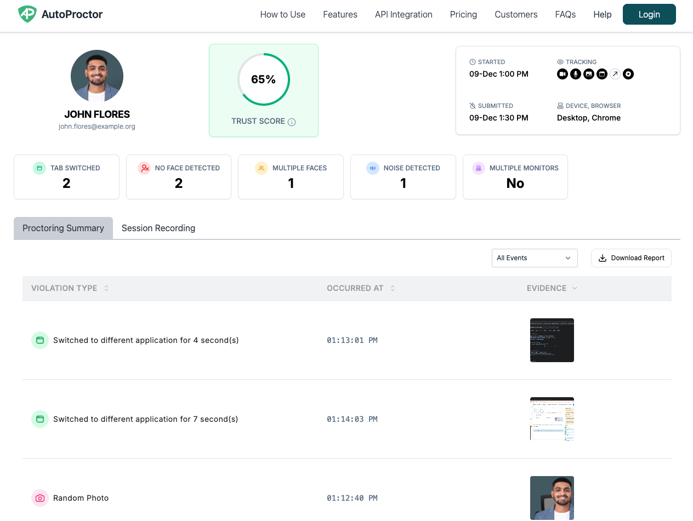

**AutoProctor does not record video.** Instead, it continuously monitors the candidate's camera feed in real time directly on their device and only captures evidence (photos, screenshots, and audio clips) when it detects a violation. This gives you the evidence you need without requiring you to watch hours of footage.

## How AutoProctor's AI Monitoring Works

Traditional proctoring platforms record a video from the candidate's camera feed, upload it to their servers, and then process it for violations. In most cases, you are expected to watch the video yourself to verify flagged incidents.

AutoProctor takes a fundamentally different approach. Its AI software monitors the video feed **directly on the candidate's device** and flags violations as they happen. No video is uploaded or stored on any server.

Think of it like a smoke detector: it runs continuously in the background, monitoring all the time, and only alerts you when something is detected.

## Key Advantages

| Advantage | How It Works |
|---|---|
| **No video review needed** | Violations are flagged automatically with supporting evidence (photos and screenshots), so you do not need to watch hours of footage |
| **Works offline** | Since monitoring happens on-device, violations are detected even if the candidate temporarily disconnects from the internet |
| **Prevents internet-off cheating** | With other platforms, candidates can turn off their internet to avoid being recorded. With AutoProctor, monitoring continues on-device regardless of connectivity |
| **Reduced administrative burden** | You review only flagged incidents instead of full recordings |
| **Lower bandwidth requirements** | No large video files are uploaded during the test, reducing network strain for candidates with slow connections |


Because monitoring happens on the candidate's device, AutoProctor captures violation evidence even when the candidate goes offline. When the candidate reconnects, the evidence syncs to the server. This is a significant advantage over platforms that rely on continuous video upload.


## What Evidence Do You Receive Instead of Video?

When AutoProctor detects a violation, it captures one or more of the following:

- **Photos** -- Snapshots from the camera feed (e.g., when no face or multiple faces are detected)
- **Screenshots** -- Captures of the candidate's screen (e.g., when they switch tabs or applications)
- **Audio clips** -- Recordings of background noise when the microphone detects suspicious audio
- **Random photos** -- Periodic snapshots taken at random intervals throughout the exam
- **Session recording** -- Records of mouse clicks and keyboard activity

*A proctoring report showing different types of violation evidence*

All of this evidence appears in the candidate's [proctoring report](tests-results/results/proctoring-results.md), organized by timestamp and violation type.


Evidence may occasionally be missing from a report if the candidate's device ran out of storage or if the browser restricted access to the camera or microphone mid-test. See [Missing Images and Recordings](tests-results/issues/missing-images-and-recordings.md) for troubleshooting steps.


## Related Resources

- [What Gets Tracked](understanding/how-proctoring-works/what-gets-tracked.md) -- All monitoring capabilities available during proctoring
- [Trust Score](understanding/how-proctoring-works/trust-score.md) -- How violation evidence is summarized into a score
- [Proctoring Results](tests-results/results/proctoring-results.md) -- How to view violation evidence and reports
- [Missing Images and Recordings](tests-results/issues/missing-images-and-recordings.md) -- Why some evidence may not appear
- [Went Offline Meaning](tests-results/issues/went-offline-meaning.md) -- What happens when a candidate goes offline during a test
